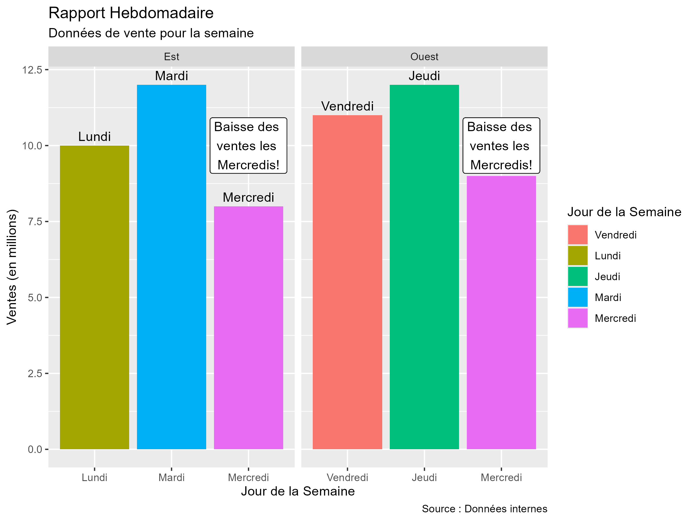

# ggtranslate

The goal of `ggtranslate` is to provide a simple and efficient way to translate all user-facing text elements within a `ggplot2` plot. This is particularly useful for creating multilingual visualizations without manually editing each plot component.

## Installation

You can install the released version of `ggtranslate` from CRAN with:
```r
install.pacakages('ggtranslate')
```

And the development version from GitHub with:
```r
install.packages("devtools")
devtools::install_github("mathiasleroy/ggtranslate")
```


## Usage
The core functionality is provided by the `ggtranslate()` function. You supply a `ggplot` object and a named list (your dictionary) where names are the original text strings found in the plot, and values are their corresponding translations.


```r
library(ggplot2)

# Sample data
df <- data.frame(
  day = c("Monday", "Tuesday", "Wednesday", "Friday", "Wednesday", "Thursday"),
  value = c(10, 12, 8, 11, 9, 12),
  region = c("East", "East", "East", "West", "West", "West")
)

# Create a plot with English labels
p_en <- ggplot(df, aes( y = value, x = day )) +
  geom_col(aes(
    fill = day,
  )) +
  labs(
    title = "Weekly Report",
    subtitle = "Sales data for the week",
    x = "Day of the Week",
    y = "Sales (in millions)",
    caption = "Source: Internal data",
    fill = "Day of the Week"
  ) +
  geom_text(aes(label = day), vjust = -0.5) +
  geom_label(label = "Sales dip on\nWednesdays!", x = "Wednesday", y = 10, vjust = .5) +
  facet_wrap(~region, scales = "free_x")
p_en


# Define the translation dictionary
dico_fr <- list(
  "Weekly Report" = "Rapport Hebdomadaire",
  "Sales data for the week" = "Données de vente pour la semaine",
  "Day of the Week" = "Jour de la Semaine",
  "Sales (in millions)" = "Ventes (en millions)",
  "Source: Internal data" = "Source : Données internes",
  "Monday" = "Lundi",
  "Tuesday" = "Mardi",
  "Wednesday" = "Mercredi",
  "Thursday" = "Jeudi",
  "Friday" = "Vendredi",
  "East" = "Est",
  "West" = "Ouest",
  "Sales dip on\nWednesdays!" = "Baisse des \nventes les \nMercredis!"
)

# Translate the plot
p_fr <- p_en |> ggtranslate(dico_fr)
p_fr

```


**Result:**
